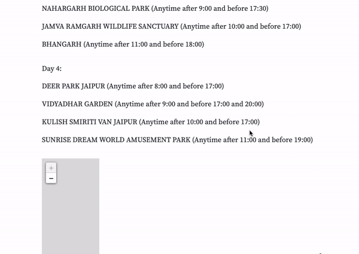
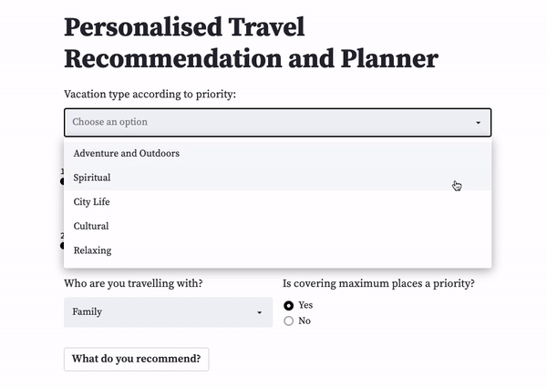
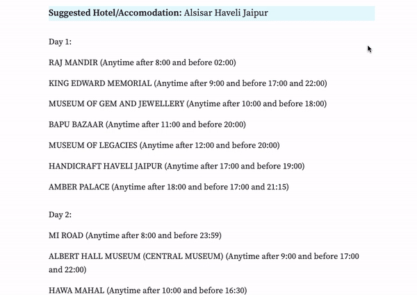

# Personalised Travel Recommender & Planner
### Visit the currently deployed version [here](https://travel-itinerary-generator.streamlit.app/).



## Aim

The widespread prevalence of recommendation systems during this current technological bloom has helped countless businesses (Some examples include streaming sites such as Netflix, Hotstar, Spotify, etc., and e-commerce sites such as Amazon, etc.) through increased customer satisfaction and convenience, and ultimately helped the internet to become more accessible as a whole. We live in a time where recommendations are so common that we tend to forget the apparent ease with which these systems, designed to optimize our consumer choices, have been incorporated into practically any device and platform. We’re used to continuously receiving recommendations, but how they have settled into our day-to-day chores is a long and interesting history marked by various obstacles and the ambition of a few pioneer companies. This gives way to numerous other possibilities for applying the above to various fields. One such field is the Travel and Tourism Industry. The proposed idea for a recommender system aims to provide the user with a suitability-wise list of options for different choices a person might have to make while on a holiday. These choices can be of various aspects of the holiday.

## Input



## Output



## How to run it locally

To run the project locally, ensure that you have cloned the repository and installed all the libraries from the requirements.txt file. You may create a virtual environment using pip or conda to make the process a bit more streamlined. 

Then, you can go ahead and run the main.py (from the root directory of the project) file using streamlit like so:
```
streamlit run main.py
```
